# 1. Documentation Roadmap

## 1.1 Document Management and Configuration Control Information

**Revision Number**: 1.0  
**Revision Release Date**: 2025-04-22  
**Purpose of Revision**: Initial consolidation of all checkpoint outputs into the SAD structure.  
**Scope of Revision**: Full document — includes content derived from Checkpoints 1 through 4.

## 1.2 Purpose and Scope of the SAD

This Software Architecture Document (SAD) defines the architecture for **Company X’s Internet-Based Collaborative Work Environment**. The SAD provides a detailed description of the system’s architectural structure, rationale, and decisions taken to meet business and technical goals.

The architecture focuses on supporting:

- Real-time collaboration (video conferencing, chat, speech)
- Shared whiteboarding and sketching
- File sharing and multi-device access
- Resilience and availability during network disruptions

This document includes architectural views, quality attribute scenarios, architectural drivers, and tradeoff analyses. It excludes lower-level implementation and unit-level design details.

## 1.3 How the SAD Is Organized

- **Section 1** provides the roadmap and introductory information, including stakeholder representation and viewpoints.
- **Section 2** presents the system overview — including goals, context, quality attributes, and architectural drivers.
- **Section 3** defines the viewpoints used in the architecture and outlines the view documentation template.
- **Section 4** documents each architectural view, including design decisions and interaction diagrams.
- **Section 5** maps elements between views and discusses consistency.
- **Section 6** provides rationale for key architectural choices.

## 1.4 Stakeholder Representation

| Stakeholder Role      | Concerns Addressed                                |
| --------------------- | ------------------------------------------------- |
| Users                 | Usability, real-time responsiveness, availability |
| Developers            | Modifiability, platform compatibility             |
| System Administrators | Fault tolerance, maintainability, deployment ease |
| Project Managers      | Scalability, on-time delivery, cost-effectiveness |
| Security Engineers    | Access control, data confidentiality              |
| Acquirers             | Risk, ROI, long-term sustainability               |

## 1.5 Viewpoint Definitions

This SAD uses a **multi-viewpoint** approach based on the "Views and Beyond" method. The primary viewpoints are:

- **Module Viewpoint**: Illustrates how the system is decomposed into modules (used by developers and maintainers).
- **Component-and-Connector Viewpoint**: Captures the system’s run-time components and their interactions (used by users, security analysts).
- **Allocation Viewpoint**: Maps software units to environments (used by system admins and project managers).

Each viewpoint is used to address specific stakeholder concerns. Views conforming to these viewpoints are presented in Section 4.

## 1.6 Sample Figures & Tables

(nothing to show here?)

# 2. System Overview

## 2.1 Business Goals

Company X seeks to empower globally distributed teams to collaborate more effectively while reducing operational overhead and minimizing the need for business travel. The main business objectives include:

- **Enable efficient collaboration** among remote teams
- **Increase decision-making speed** through real-time communication
- **Reduce operational costs** by lowering infrastructure and travel expenditures
- **Decrease travel times** by enabling seamless remote work
- **Support cross-platform accessibility** to allow team members to work from any device

These goals directly influence architectural priorities, especially concerning performance, availability, portability, and modifiability.

## 2.2 System Context

The system is a **web-based Internet-based collaborative work environment** designed to support both synchronous and asynchronous collaboration. It connects **team members** and **system administrators** via the internet.

- **Actors**:

  - _Team Members_: End users who initiate video calls, sketch diagrams, share files, and communicate.
  - _Administrators_: Configure system settings, monitor infrastructure, and manage access control.

- **Key Interactions**:
  - Users interact with a responsive UI across various platforms.
  - The system ensures secure real-time communication and session persistence.
  - Admins oversee uptime, configuration, and monitoring.

### Context Diagram

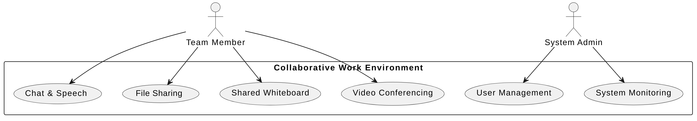

PlantUML

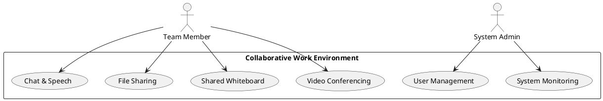

## 2.3 Functions

Key system functions include:

- **Real-time video/audio conferencing**: Enables instant and seamless synchronous communication.
- **Shared whiteboard**: Allows users to draw, brainstorm, and collaborate visually in real time.
- **Chat and speech modules**: Support ongoing communication in both synchronous and asynchronous formats.
- **File sharing and management**: Upload, download, and collaborate on shared documents.
- **Cross-device compatibility**: Enables users to access the system from desktops, tablets, smartphones, and smart devices.

## 2.4 Quality Attribute Requirements

Derived from the business and engineering objectives, prioritized quality attributes include:

- **Performance** (High):
  - Real-time video/audio must maintain latency < 200ms.
  - Whiteboard and collaboration tools must respond within seconds.
- **Availability** (High):
  - Uptime ≥ 99.95%.
  - Must gracefully handle network interruptions and resume sessions.
- **Portability** (Medium–High):
  - Accessible on diverse OSs and devices, with at least 90% UI feature availability on legacy mobile devices.
- **Usability** (Medium):
  - Non-technical users must be able to configure settings and navigate easily.
- **Modifiability** (Medium–High):
  - Future feature additions like chat modules or integrations should be easy to plug in with minimal disruption.
- **Security** (Medium):
  - End-to-end encryption, role-based access control, and secure file transfer are critical.

## 2.5 Constraints

While the project was not assigned fixed constraints, several **anticipated constraints** were identified:

- **Time**: Tight deadlines may prioritize minimum viable functionality, emphasizing modular design for phased expansion.
- **Budget**: Potential funding limitations suggest tradeoffs between premium features and core capabilities, favoring performance optimization.
- **Technical**: Must support legacy mobile and desktop environments, requiring lightweight front-end design and platform abstraction.

These constraints directly impact architecture decisions related to modularity, CI/CD pipelines, and layered service design.

## 2.6 Architecture Concerns

The system faces the following **technical, environmental, and business** architecture concerns:

- **Technical**:
  - Support for low-latency video and drawing
  - Real-time data consistency across multiple users
  - Secure data transmission and access control
- **Environmental**:
  - Variable connectivity, including mobile data or offline access
  - Resource-constrained devices (older phones/tablets)
- **Business**:
  - Integration with existing enterprise infrastructure
  - Support for both synchronous (calls, sketches) and asynchronous (file, comments) collaboration

## 2.7 Architecture Drivers

The primary **architecture drivers** shaping the system are:

- **Real-time performance requirements** for collaboration and communication
- **High availability**, including session resilience under unstable networks
- **Portability and device diversity**, supporting cross-platform access
- **Security** for sensitive business communications
- **Modifiability** to adapt quickly to feature requests (e.g., chat plugins)
- **Scalability** to accommodate growing teams and usage patterns

These drivers are further explored through Attribute-Driven Design (ADD) iterations and guide the selection of architectural patterns and tactics in later sections.

# 3. View Template

## 3.1 Viewpoint Definitions

The architecture of the Internet-Based Collaborative Work Environment is described using three primary viewpoints, each addressing a specific class of stakeholder concerns:

### 3.1.1 Module Viewpoint

**Abstract**  
The module viewpoint focuses on the static structure of the software system, defining how the system is decomposed into implementation units (modules). These include logical groupings of functionality, like video conferencing, file sharing, and collaboration services.

**Stakeholders and Their Concerns Addressed**

- **Developers**: Understand code ownership, responsibilities, and boundaries
- **Maintainers**: Need isolation of concerns for easy updates
- **Project Managers**: Track progress across development teams

**Elements, Relations, Properties, and Constraints**

- **Elements**: Modules (e.g., UI Module, Video Module, Collaboration Module)
- **Relations**: Uses, depends on, generalizes
- **Properties**: Modularity, language/platform independence
- **Constraints**: Modules must have well-defined interfaces

**Language(s) to Model/Represent Conforming Views**

- UML Component Diagrams
- Structured Package Diagrams

**Applicable Evaluation/Analysis Techniques and Criteria**

- Dependency analysis
- Modifiability and impact analysis

**Viewpoint Source**  
SEI Views and Beyond, IEEE 1471

### 3.1.2 Component-and-Connector Viewpoint

**Abstract**  
This viewpoint captures the system’s runtime behavior by documenting components that perform computation and connectors that represent communication paths or data exchange.

**Stakeholders and Their Concerns Addressed**

- **Users**: Want reliable, low-latency experiences
- **Security Engineers**: Focused on runtime access and data protection
- **System Architects**: Ensure runtime reliability and fault-tolerance

**Elements, Relations, Properties, and Constraints**

- **Elements**: Components (Video Service, File Service), Connectors (APIs, WebSocket)
- **Relations**: Data flow, message passing
- **Properties**: Latency, throughput, session management
- **Constraints**: Components should be loosely coupled, highly available

**Language(s) to Model/Represent Conforming Views**

- Sequence Diagrams
- UML Deployment Diagrams
- PlantUML interaction models

**Applicable Evaluation/Analysis Techniques and Criteria**

- Performance benchmarking
- Availability simulation
- Fault injection testing

**Viewpoint Source**  
SEI Views and Beyond, Kruchten’s “4+1” Model

### 3.1.3 Allocation Viewpoint

**Abstract**  
This viewpoint maps software units to the physical or environmental structures that host, develop, or operate them — such as hardware, network topology, and team responsibilities.

**Stakeholders and Their Concerns Addressed**

- **System Administrators**: Need to monitor deployment infrastructure
- **Project Managers**: Concerned with team-task allocation
- **Ops Engineers**: Manage cloud/service distribution and load balancing

**Elements, Relations, Properties, and Constraints**

- **Elements**: Servers, containers, development teams, files
- **Relations**: Executes-on, assigned-to, stored-in
- **Properties**: Resource constraints, team skills, availability zones
- **Constraints**: Blue-green deployment support; redundancy for services

**Language(s) to Model/Represent Conforming Views**

- Deployment Topology Diagrams
- Infrastructure-as-Code blueprints
- PlantUML system layout diagrams

**Applicable Evaluation/Analysis Techniques and Criteria**

- CI/CD deployment traceability
- Infrastructure health monitoring
- Cloud cost and load balancing analysis

**Viewpoint Source**  
IEEE 42010, SEI Views and Beyond

## 3.2 How a View is Documented

Each view will be documented using a structured format to ensure completeness and clarity:

- **Section 4.i**: View Name
- **Section 4.i.1**: View Description
- **Section 4.i.2**: Architecture Background
- **Section 4.i.3**: View Packets
  - **Section 4.i.3.j.1**: Primary Presentation
  - **Section 4.i.3.j.2**: Context Diagram
  - **Section 4.i.3.j.3.1–3.5**: Element Catalog (elements, relations, interfaces, behavior, constraints)
  - **Section 4.i.3.j.4**: Architecture Background (design rationale)

Each view is aligned with its respective viewpoint and will be populated with diagrams, detailed descriptions, and justification for design choices made during the ADD process.

# 4. Views

This section documents the system's architecture using three views:

- Module View (Static structure)
- Component-and-Connector View (Runtime behavior)
- Allocation View (Deployment and mapping)

Each view contains a primary presentation, context diagram, element catalog, and design rationale.

## 4.1 Module View

#### 4.1.1 View Description

The module view shows how the system is decomposed into high-level functional modules. This includes the Client Tier, Application Tier, and Infrastructure Tier, with each module encapsulating specific responsibilities such as user interaction, business logic, and system-wide services.

This decomposition follows a layered architectural style, supporting modularity, separation of concerns, and maintainability. The design uses Microservices and Client-Server patterns.

#### 4.1.2 Primary Presentation

**NOTE: Rough draft of the section. Need to update.**
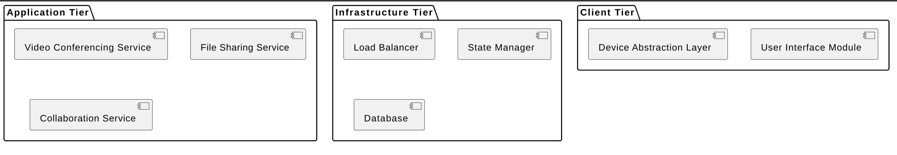

PlantUML

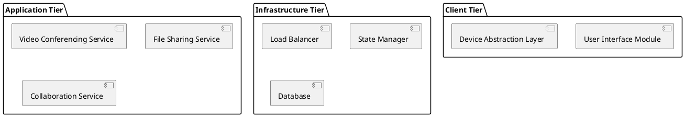

#### 4.1.3 Context Diagram

PlantUML

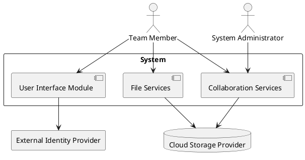

**NOTE: Rough draft of the section. Need to update.**

> All modules interact to deliver a seamless user experience, communicating through defined interfaces.

#### 4.1.4 Element Catalog

- **Elements**: Modules defined per tier
- **Relations**: Dependencies among modules; data and service flow
- **Interfaces**: REST APIs between tiers
- **Behavior**: Each module manages its own lifecycle and interfaces
- **Constraints**: Loose coupling and high cohesion

#### 4.1.5 Architecture Background

The modular approach facilitates independent development, testing, and scaling of features (e.g., adding chat to the collaboration module).

## 4.2 Component-and-Connector View

#### 4.2.1 View Description

This view models runtime interactions between components, such as joining a call, sharing files, or drawing on a whiteboard. Components communicate via REST, WebSocket, and message queues.

Design uses Publish-Subscribe and Proxy patterns for real-time responsiveness and security. Performance and availability are emphasized through load balancing and fault tolerance.

#### 4.2.2 Primary Presentation

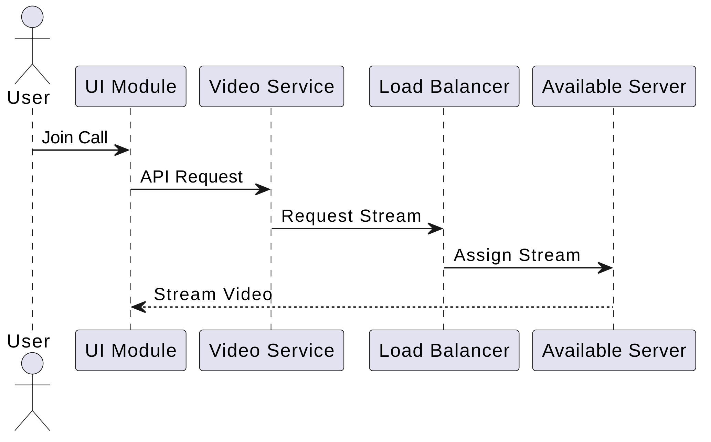

PlantUML

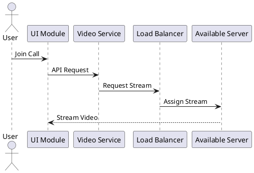

#### 4.2.3 Context Diagram

PlantUML

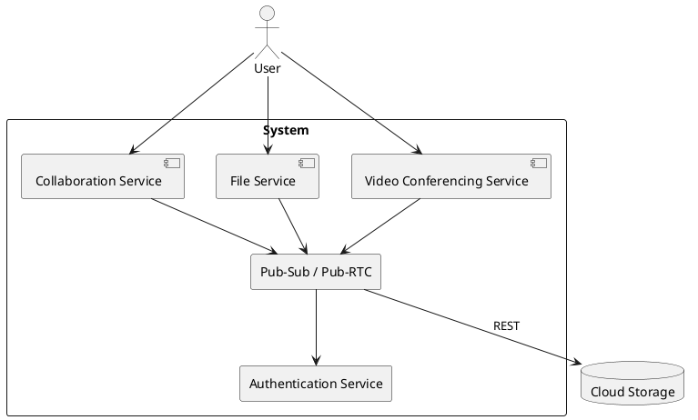

> Focuses on runtime interactions across network layers.

#### 4.2.4 Element Catalog

- **Elements**: UI Module, Services, Load Balancer
- **Relations**: API calls, WebSocket streams, pub-sub messaging
- **Interfaces**: REST, HTTPS, WebSockets
- **Behavior**: State caching, real-time sync, authentication
- **Constraints**: Resilience to network failures

#### 4.2.5 Architecture Background

Microservices allow independent failure handling and reusability. Load balancers and state managers ensure performance and reliability.

## 4.3 Allocation View

#### 4.3.1 View Description

Maps software units to execution environments (servers, containers), storage systems, and developer responsibilities.

Uses containerization and a CI/CD deployment pipeline with a **blue-green strategy** for continuous updates with zero downtime.

#### 4.3.2 Primary Presentation

**NOTE: Rough draft of the section. Need to update.**

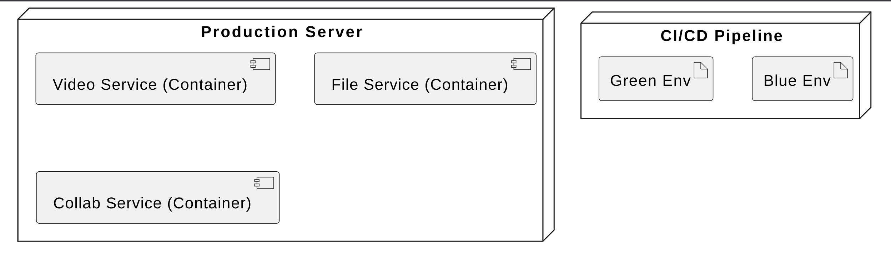

PlantUML

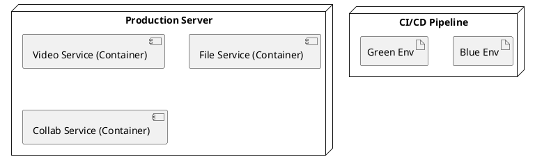

#### 4.3.3 Context Diagram

PlantUML

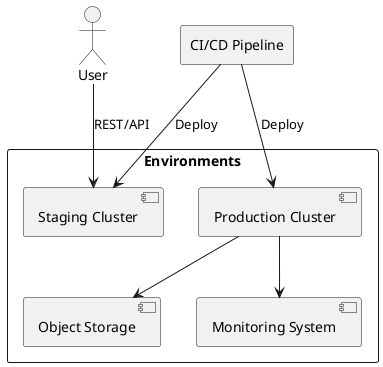

> Shows live and staging environments, auto-deployment flow, and containerized services.

#### 4.3.4 Element Catalog

- **Elements**: Docker containers, deployment servers, CI/CD agents
- **Relations**: Assigned-to, executes-on
- **Interfaces**: Git triggers, API gateways, cloud interfaces
- **Behavior**: Blue-green deployment, rollback, health checks
- **Constraints**: Zero-downtime updates, cost constraints

#### 4.3.5 Architecture Background

CI/CD practices increase modifiability. Blue-green deployments reduce availability risk during updates. Containers offer platform independence.

# 5. Mapping Between Views

## 5.1 General Relations Among Views

The architectural views defined in this SAD are interrelated and collectively describe the complete architecture. While each view addresses different concerns and audiences, their elements are often manifestations of the same underlying system capabilities, expressed at different levels of abstraction.

The general relationships among the views are:

- **Modules (from the Module View)** are implemented as runtime **components (in the Component-and-Connector View)**. For example, the `File Sharing Module` corresponds to the `File Sharing Service` component.
- **Components** are **deployed onto infrastructure resources (Allocation View)** such as containers and physical servers.
- **Responsibilities** defined in modules are mapped to **runtime behaviors** and then **assigned to execution environments**.

This traceability enables:

- Easier impact analysis when a requirement or component changes
- View consistency checks
- Better team allocation (who owns what and where it runs)

## 5.2 View-to-View Relations

Below is a summary of how elements in one view map to elements in another:

| Module View Element         | Component View Element     | Allocation View Element              |
| --------------------------- | -------------------------- | ------------------------------------ |
| `User Interface Module`     | `UI Component`             | Deployed on `Web Frontend Container` |
| `Video Conferencing Module` | `Video Service`            | Runs in `Video Docker Container`     |
| `File Sharing Module`       | `File Sharing Service`     | Allocated to `File Server`           |
| `Collaboration Module`      | `Collab Service`           | Hosted in `Collaboration Container`  |
| `Device Abstraction Layer`  | Part of `UI Component`     | Cross-platform rendering in browser  |
| `State Manager`             | `State Sync Component`     | Cloud-hosted for persistence         |
| `Security Proxy Module`     | `Security Proxy Component` | Embedded in `Application Gateway`    |

**Consistency Across Views**:

- **Naming conventions** are synchronized across all views to allow traceability (e.g., modules and services share base names).
- **Interfaces** defined in modules are instantiated as **runtime APIs** and **allocated as endpoints** in the cloud deployment.

**Known or Potential Inconsistencies**:

- While modules are designed for reusability, runtime performance tradeoffs may lead to different scaling strategies in deployment (e.g., horizontal scaling for video services but not whiteboarding).
- Resource availability in the allocation view (e.g., cost-driven container limits) may impact decisions assumed in the component view.

This mapping ensures cohesion among views and helps validate that all architectural decisions support business and quality attribute goals in a traceable and consistent manner.

# 6. Rationale

The architectural decisions made throughout the design of the Internet-Based Collaborative Work Environment were driven by a combination of high-priority quality attribute scenarios, technical and environmental constraints, and stakeholder needs. This section provides a summary of why certain architectural patterns, tactics, and structures were chosen and how they collectively support the business and engineering goals.

## Key Drivers Behind Architecture

- **Performance** was prioritized to support real-time video, audio, and collaborative editing.
- **Availability** was essential for ensuring uninterrupted communication and minimizing data loss during network disruptions.
- **Portability** was addressed to support heterogeneous device and OS environments.
- **Modifiability** and **Scalability** were emphasized to allow future feature expansion and accommodate user growth.
- **Security** was a secondary but essential consideration due to the nature of shared corporate content.

## Major Architectural Decisions and Their Rationale

### 1. **Three-Tier Architecture (Client, Application, Infrastructure)**

- **Why Chosen**: Promotes separation of concerns and allows independent scalability, development, and deployment.
- **Implication**: Enhances modifiability and maintainability. Supports high availability by decoupling service responsibilities.

### 2. **Microservices Pattern**

- **Why Chosen**: Enables independent deployment and scaling of services like video, file sharing, and whiteboarding.
- **Implication**: Improves resilience and fault isolation. Increases system complexity due to service orchestration and inter-service communication.

### 3. **Client-Server Pattern with Web-Based UI**

- **Why Chosen**: Ensures cross-platform compatibility with centralized control and lightweight client requirements.
- **Implication**: Supports portability and usability. May introduce latency on low-end devices, which is mitigated via backend offloading.

### 4. **Load Balancing and Caching (Performance Tactics)**

- **Why Chosen**: Addressed the critical latency needs for video conferencing and real-time collaboration.
- **Implication**: Improves user experience but introduces operational overhead and requires careful tuning.

### 5. **State Resynchronization & Heartbeat (Availability Tactics)**

- **Why Chosen**: Ensure session continuity during network drops or high load conditions.
- **Implication**: Adds system complexity and infrastructure needs but is essential for real-time collaborative reliability.

### 6. **Blue-Green Deployment Strategy**

- **Why Chosen**: Enables seamless system updates with zero downtime, reducing business disruption.
- **Implication**: Requires duplicate infrastructure during deployment windows, which has cost implications.

### 7. **Plugin-Based Extension for Collaboration Features**

- **Why Chosen**: Provides flexibility for adding features like chat, annotations, or integrations in the future.
- **Implication**: Introduces integration complexity and requires well-defined plugin interfaces.

### 8. **Security Proxies and TLS**

- **Why Chosen**: Ensures secure access and encrypted communication without burdening each individual service.
- **Implication**: Centralizes security enforcement and simplifies auditability, though introduces a single point of potential failure if not redundant.

## Tradeoff Decisions and Mitigations

| Conflict                     | Resolution                                                                                                          |
| ---------------------------- | ------------------------------------------------------------------------------------------------------------------- |
| Performance vs. Availability | Prioritized performance in real-time paths (e.g., video), while using async state recovery to preserve availability |
| Portability vs. Performance  | Chose web technologies with lightweight frameworks (e.g., React), and delegated heavy tasks to backend              |
| Usability vs. Modifiability  | Used Facade pattern in the UI to support simple interfaces while isolating backend complexity                       |
| Modifiability vs. Security   | Enforced plugin scope and used proxy-based security to manage risks in dynamic module loading                       |
| Availability vs. Cost        | Opted for auto-scaling and resource optimization in Blue-Green environments to contain infrastructure cost          |

## Conclusion

The resulting architecture aligns with the company’s mission to enable seamless, secure, and flexible collaboration across teams worldwide. By grounding each decision in quality attributes and using iterative ADD design, the architecture balances short-term deliverability with long-term system resilience and extensibility.
